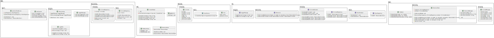

# TheSearch

## Описание:

Консольное приложение для поиска преступников.

## Возможности:

- Поиск данных по параметрам (рост, вес, национальность).
- Просмотр и изминение списков данных.
- Аутентификация пользователя в приложении.
- Логирование данных пользователя в файл.
- Сериализация и десериализация данных в JSON.
- Методы поиска и фильтрация данных через LINQ запросы.
- Базовая валидация вводимых данных, обработка исключений.
- Тестирование методов программы в отдельном проекте.
- Консольный интерфейс.

## Внедрение рекомендуемых технологий:
- Использование SOLID принципов:
    - Разделение на слои (BLL, DAL, Models, VL, IL)
    - Использование интерфейсов
    - Возможность расширения программы
- Использование паттернов проектирования:
    - Factory method
    - Repository
- Парадигмы ООП.

## Остальная информация:
- Язык программирования:
    - С#
- Библиотеки для тестирования:
    - FakeItEasy
    - AutoFixture
## Диаграмма классов приложения:

